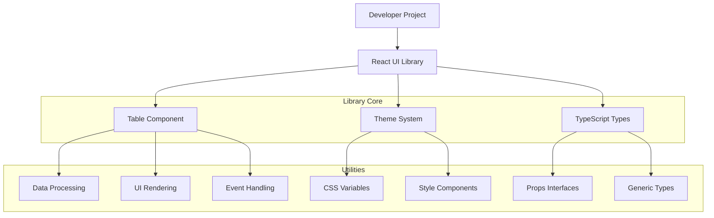
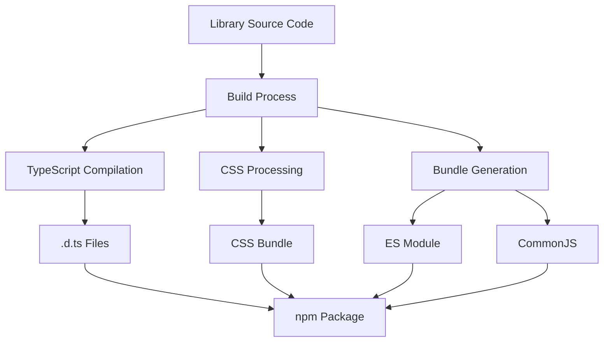
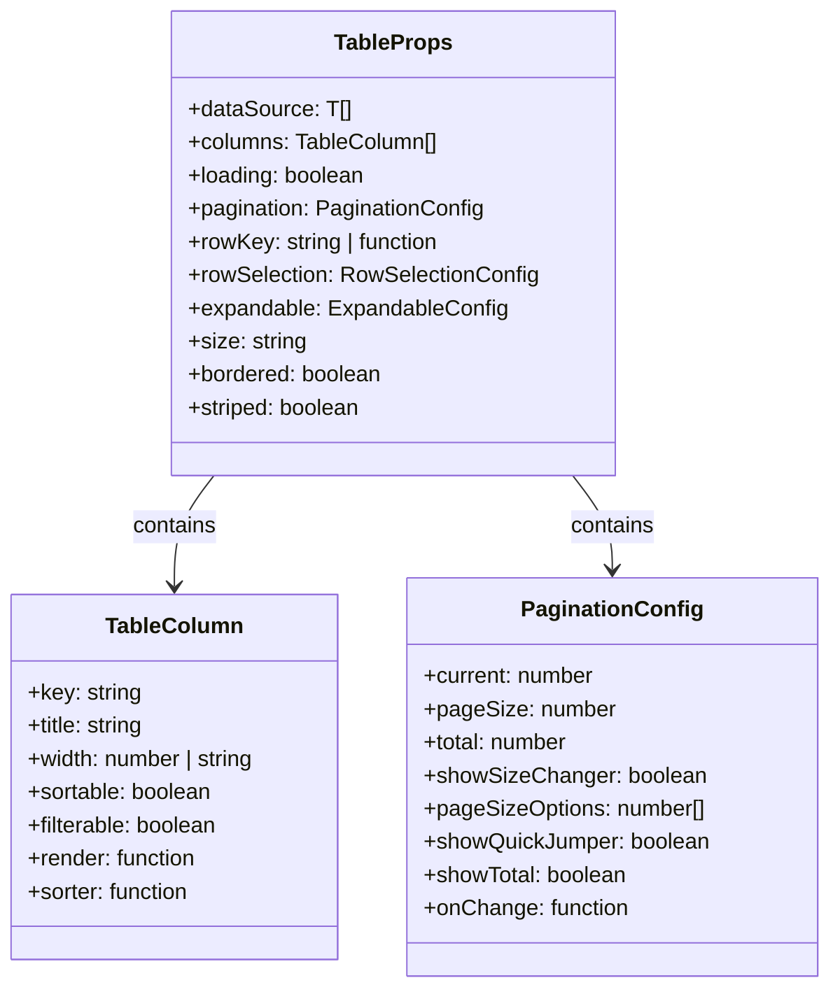

## 1. Architecture design



## 2. Technology Description

- **Frontend**: React@18 + TypeScript@5 + Vite@5
- **Styling**: CSS Modules + CSS Variables
- **Build**: Rollup + TypeScript Compiler
- **Testing**: Jest + React Testing Library
- **Linting**: ESLint + Prettier
- **Package Manager**: pnpm

## 3. Route definitions

| Route | Purpose |
|-------|---------|
| / | 文档首页，展示组件库概览 |
| /components/table | Table组件文档和示例 |
| /guide/quick-start | 快速开始指南 |
| /guide/theme | 主题定制文档 |

## 4. API definitions

### 4.1 Table Component API

```typescript
// 基础数据类型
interface TableColumn<T> {
  key: keyof T;
  title: string;
  width?: number | string;
  sortable?: boolean;
  filterable?: boolean;
  render?: (value: T[keyof T], record: T, index: number) => React.ReactNode;
  sorter?: (a: T, b: T) => number;
}

interface TableProps<T> {
  dataSource: T[];
  columns: TableColumn<T>[];
  loading?: boolean;
  pagination?: PaginationConfig | false;
  rowKey?: keyof T | ((record: T) => string);
  rowSelection?: RowSelectionConfig<T>;
  expandable?: ExpandableConfig<T>;
  onRowClick?: (record: T, index: number) => void;
  className?: string;
  style?: React.CSSProperties;
  size?: 'small' | 'medium' | 'large';
  bordered?: boolean;
  striped?: boolean;
}

interface PaginationConfig {
  current?: number;
  pageSize?: number;
  total?: number;
  showSizeChanger?: boolean;
  pageSizeOptions?: number[];
  showQuickJumper?: boolean;
  showTotal?: boolean;
  onChange?: (page: number, pageSize: number) => void;
}

interface RowSelectionConfig<T> {
  type: 'checkbox' | 'radio';
  selectedRowKeys?: string[];
  onChange?: (selectedRowKeys: string[], selectedRows: T[]) => void;
  getCheckboxProps?: (record: T) => { disabled?: boolean };
}

interface ExpandableConfig<T> {
  expandedRowRender: (record: T) => React.ReactNode;
  expandedRowKeys?: string[];
  onExpand?: (expanded: boolean, record: T) => void;
}
```

## 5. Server architecture diagram



## 6. Data model

### 6.1 组件配置模型



### 6.2 构建配置

```json
// package.json
{
  "name": "@your-org/react-ui-library",
  "version": "1.0.0",
  "main": "dist/index.js",
  "module": "dist/index.esm.js",
  "types": "dist/index.d.ts",
  "files": ["dist"],
  "scripts": {
    "build": "rollup -c",
    "dev": "vite",
    "test": "jest",
    "lint": "eslint src --ext .ts,.tsx",
    "prepublishOnly": "npm run build"
  },
  "peerDependencies": {
    "react": ">=16.8.0",
    "react-dom": ">=16.8.0"
  },
  "devDependencies": {
    "@types/react": "^18.0.0",
    "@types/react-dom": "^18.0.0",
    "typescript": "^5.0.0",
    "vite": "^5.0.0",
    "rollup": "^4.0.0",
    "@rollup/plugin-typescript": "^11.0.0"
  }
}
```

### 6.3 样式系统

```css
/* 设计令牌 */
:root {
  /* 颜色系统 */
  --color-primary: #0066cc;
  --color-primary-hover: #0052a3;
  --color-background: #ffffff;
  --color-surface: #f7fafc;
  --color-text: #2d3748;
  --color-text-secondary: #718096;
  --color-border: #e2e8f0;
  --color-border-hover: #cbd5e0;
  
  /* 圆角 */
  --radius-small: 4px;
  --radius-medium: 8px;
  --radius-large: 12px;
  
  /* 阴影 */
  --shadow-small: 0 1px 3px rgba(0, 0, 0, 0.1);
  --shadow-medium: 0 4px 6px rgba(0, 0, 0, 0.1);
  --shadow-large: 0 10px 15px rgba(0, 0, 0, 0.1);
  
  /* 动画 */
  --transition-fast: 0.15s ease;
  --transition-medium: 0.3s ease;
  --transition-slow: 0.5s ease;
}

/* 深色模式 */
@media (prefers-color-scheme: dark) {
  :root {
    --color-background: #1a202c;
    --color-surface: #2d3748;
    --color-text: #f7fafc;
    --color-text-secondary: #a0aec0;
    --color-border: #4a5568;
    --color-border-hover: #718096;
  }
}
```